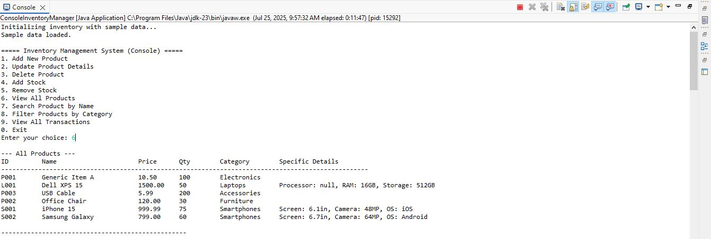
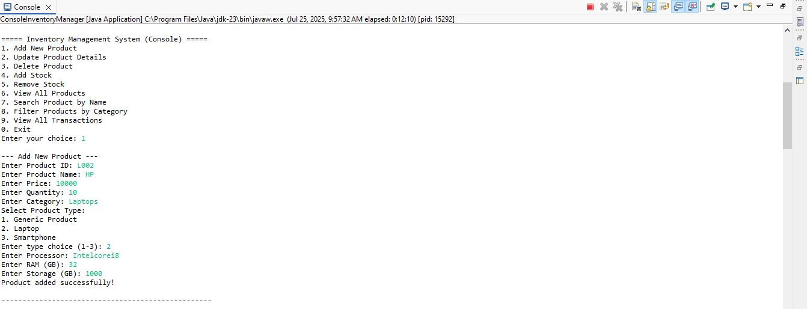
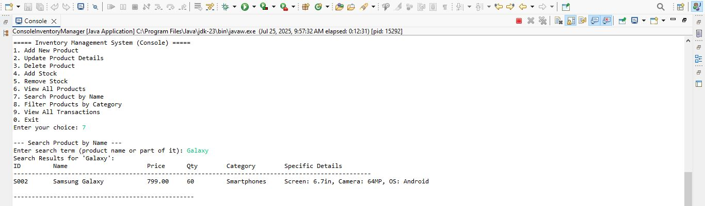
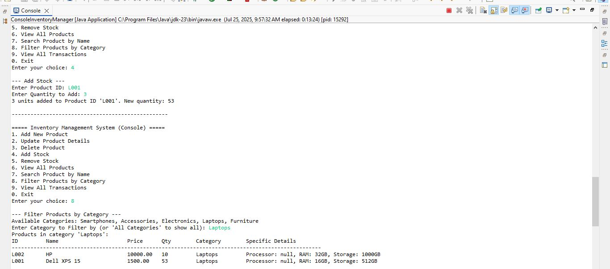

# Inventory Management System

A Java console application for managing product inventory with support for different product types, stock management, and transaction tracking.

| | |
|:-------------------------:|:-------------------------:|
|  |  |
|  |  |

## Introduction
The Inventory Management System is a robust console application built with Java that allows businesses to track their inventory of products. The system supports generic products as well as specialized product types (Laptops and Smartphones) with their specific attributes. It features comprehensive stock management, transaction logging, and various filtering/search capabilities.

## Features
- **Product Management**:
  - Add/Update/Delete products
  - Support for generic products and specialized types (Laptops, Smartphones)
  - Input validation for all product attributes
- **Stock Control**:
  - Add/Remove stock quantities
  - Prevent negative stock levels
- **Search & Filter**:
  - Search products by name
  - Filter products by category
- **Transaction Tracking**:
  - Automatic logging of all stock movements
  - View complete transaction history
- **Data Visualization**:
  - Formatted tabular display of products
  - Detailed view of product attributes

## Core Concepts Implemented
- **OOP Principles**:
  - Inheritance (Product -> Laptop/Smartphone)
  - Polymorphism (handling different product types)
  - Encapsulation (private fields with public methods)
  - Abstraction (simplified interfaces)
- **Collections Framework**:
  - HashMap for efficient product lookup
  - ArrayList for transaction storage
  - Stream API for filtering/searching
- **Exception Handling**:
  - Robust input validation
  - Graceful error recovery

## Technologies Used
- **Core Java** (v8+)
- **Java Collections Framework** (HashMap, ArrayList)
- **Java Stream API** (for filtering operations)
- **Java Time API** (for transaction timestamps)

## Installation & Usage
1. Ensure you have Java JDK 8+ installed
2. Clone the repository:
   ```bash
   git clone https://github.com/WasifaKanwal12/InventoryManagementSystem.git
   ```
3. Compile all Java files:
   ```bash
   javac com/InventoryManagement/*.java
   ```
4. Run the application:
   ```bash
   java com.InventoryManagement.ConsoleInventoryManager
   ```

